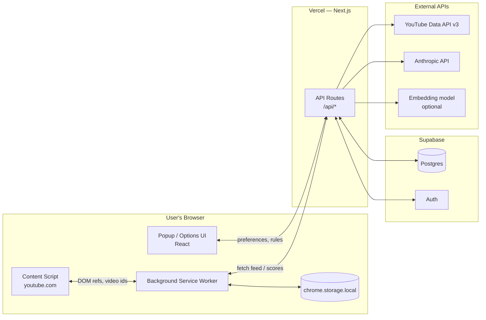
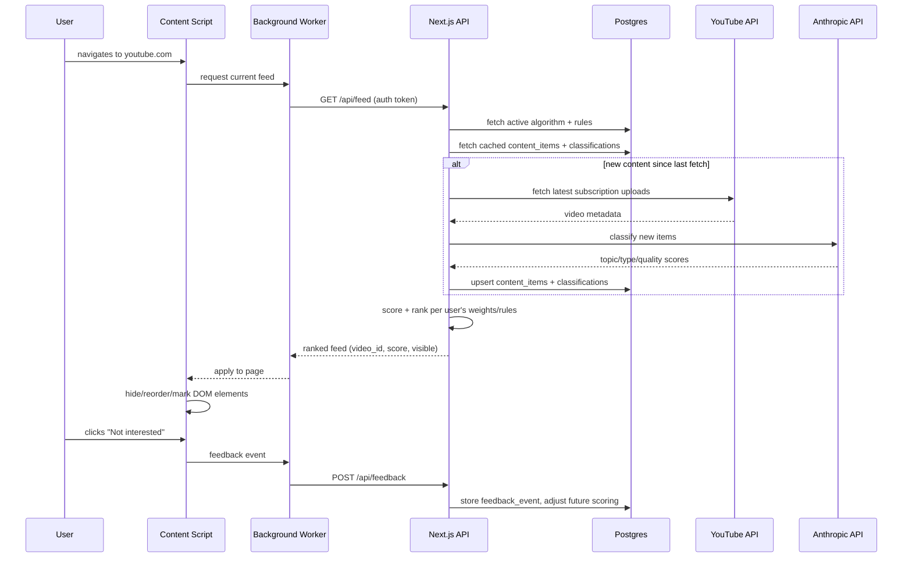
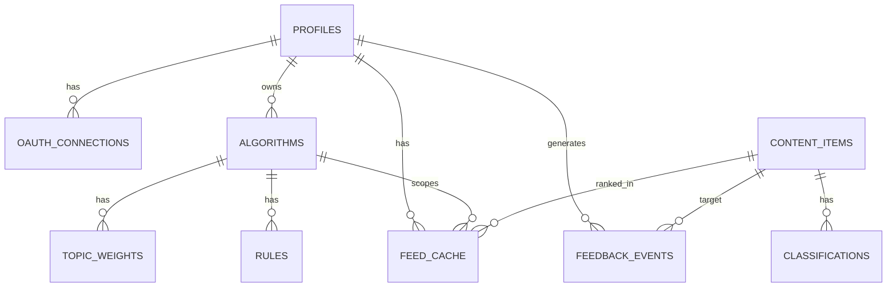

# Architecture — Personal Algorithm (YouTube MVP)

*Solo-founder, bootstrapped, lean stack. Scope: Chrome extension + web dashboard controlling a user's YouTube feed via their own subscriptions/rules.*

---

## 1. Product Summary

A Chrome extension (MV3) + lightweight web dashboard that lets a user define "algorithms" (topic weights + always/never-show rules), then reshapes what they see on youtube.com to match — sourced from their own subscriptions/uploads via the official YouTube Data API, scored by deterministic metadata rules with optional AI fallback, and applied client-side.

## 2. Guiding Principles

- **No servers to manage.** Everything serverless/managed (Vercel + Supabase).
- **One language.** TypeScript everywhere — extension, API, scripts.
- **Defer complexity.** No queues, no microservices, no k8s until usage data demands it.
- **Cheap by default.** Every chosen service has a real free tier.

## 3. Recommended Stack

| Layer | Choice | Why |
|---|---|---|
| Extension | Manifest V3, TypeScript, Vite + CRXJS, React (popup/options) | Modern MV3 tooling, fast HMR, small bundle |
| Web app + API | Next.js (App Router), deployed on Vercel | Serverless API routes, same repo as dashboard, zero ops |
| Database | Supabase (managed Postgres) | Postgres + Auth + Row Level Security, generous free tier |
| Auth | Supabase Auth + Google OAuth | Same OAuth flow doubles as YouTube API authorization |
| Classification | Deterministic metadata classifier first; optional AI resolver later | Cheap fallback path with room for semantic disambiguation |
| Semantic retrieval (next stage) | Supabase Postgres + pgvector | Canonical concepts, aliases, embeddings, and semantic topic matching |
| Cache (later, Stage 2+) | Upstash Redis | Serverless, pay-per-request, add only when Postgres read load justifies it |
| Error tracking | Sentry | Free tier covers extension + backend |
| Extension distribution | Chrome Web Store | Required for public MV3 distribution |
| Monorepo tooling | pnpm workspaces (+ Turborepo optional) | One repo, shared types between extension and web |

## 4. High-Level Architecture



## 5. Folder Structure

```
personal-algorithm/
├── apps/
│   ├── extension/                     # Chrome MV3 extension
│   │   ├── src/
│   │   │   ├── background/
│   │   │   │   └── index.ts           # service worker: session, polling, messaging
│   │   │   ├── content-scripts/
│   │   │   │   └── youtube.ts         # reads feed DOM, hides/reorders/marks
│   │   │   ├── popup/
│   │   │   │   ├── Popup.tsx          # quick mode switch (Work/Learning/Relax)
│   │   │   │   └── main.tsx
│   │   │   ├── options/
│   │   │   │   ├── Options.tsx        # full rule/weight editor
│   │   │   │   └── main.tsx
│   │   │   ├── lib/
│   │   │   │   ├── api-client.ts
│   │   │   │   ├── storage.ts         # typed chrome.storage wrapper
│   │   │   │   └── messaging.ts       # typed runtime messages
│   │   │   └── manifest.json
│   │   ├── vite.config.ts
│   │   └── package.json
│   │
│   └── web/                           # Next.js dashboard + API
│       ├── app/
│       │   ├── (dashboard)/
│       │   │   ├── page.tsx               # feed preview / "why am I seeing this"
│       │   │   ├── algorithms/page.tsx    # manage modes (Work/Learning/Relax)
│       │   │   └── rules/page.tsx
│       │   ├── api/
│       │   │   ├── auth/[...supabase]/route.ts
│       │   │   ├── algorithms/route.ts
│       │   │   ├── rules/route.ts
│       │   │   ├── feed/route.ts          # returns ranked+filtered feed
│       │   │   ├── classify/route.ts      # internal: scores new content
│       │   │   └── feedback/route.ts      # not-interested / more-like-this
│       │   └── layout.tsx
│       ├── lib/
│       │   ├── supabase/
│       │   │   ├── client.ts
│       │   │   └── server.ts
│       │   ├── youtube.ts               # YT Data API wrapper
│       │   ├── classifier.ts            # Anthropic API wrapper
│       │   └── scoring.ts               # weight/rule → score logic
│       └── package.json
│
├── packages/
│   ├── shared-types/                    # Zod schemas + TS types, shared by both apps
│   │   └── src/index.ts
│   └── db/
│       ├── schema.sql
│       └── migrations/
│
├── infra/
│   ├── supabase/                        # supabase CLI config, RLS policies
│   └── vercel.json
│
├── .github/workflows/ci.yml
├── package.json
├── pnpm-workspace.yaml
└── README.md
```

## 6. What Each Part Does

### Extension
- **Content script (`youtube.ts`)** — runs on youtube.com; reads video card metadata from the rendered DOM, sends candidate items to the background worker, then hides/reorders/visually marks elements based on the scores it gets back.
- **Background service worker** — holds the user's session token, periodically calls `/api/feed`, caches results in `chrome.storage.local`, relays messages between popup, options page, and content script.
- **Popup** — lightweight: shows which "algorithm" (mode) is active, quick toggle between modes, link to the full options page.
- **Options page** — full editor: topic weight sliders, always-show/never-show rule builder, "why am I seeing this" explanations.

### Web app (Next.js on Vercel)
- **Dashboard** — same rule/weight editor as the options page (shares components + `shared-types`); lets a user configure preferences before even installing the extension, useful for onboarding.
- **API routes** — stateless serverless functions, nothing persistent to patch or restart.
  - `/api/feed` — pulls cached subscription content, scores it against the user's active algorithm, returns ranked + filtered list.
  - `/api/classify` — internal job: for new content_items, calls the Anthropic API to tag topic/type/quality, stores the result.
  - `/api/feedback` — records not-interested / more-like-this / never-show events for future scoring adjustments.

### Database (Supabase Postgres)
- Single source of truth for everything except ephemeral UI state.
- Row Level Security (RLS) scopes every table to `auth.uid()`, so a user can only ever read/write their own rows — removes an entire class of authorization bugs for a solo dev with no time to hand-roll access control.

## 7. Where State Lives

| State | Location | Why |
|---|---|---|
| Auth session | Supabase Auth JWT (extension: `chrome.storage.local`; web: cookie) | Standard, secure, shared across both surfaces |
| Rules/weights (source of truth) | Postgres: `algorithms`, `topic_weights`, `rules` | Durable, queryable, portable across devices |
| YouTube OAuth tokens | Postgres: `oauth_connections`, server-side only; encryption at rest is a launch blocker | Never stored in the browser |
| Raw fetched content metadata | Postgres: `content_items` | Reusable across users with overlapping subscriptions — avoids refetching |
| Classification scores | Postgres: `classifications` | Cached per item, avoids re-calling the classifier every load |
| Topic concepts and intent | Postgres + pgvector: concept table and intent cache | Maps custom terms, slang, aliases, and goals to canonical concepts; persists algorithm intent profiles per user algorithm |
| Current visible feed / rank | Postgres: `feed_cache` (short TTL), mirrored into `chrome.storage.local` | DB is the source of truth; local storage is a fast read cache for the content script |
| "Hidden this session" video IDs | `chrome.storage.local` only | Ephemeral UI state, no reason to sync to the server |

## 8. Data Flow — "User opens youtube.com"



## 9. Database Schema

```sql
-- Supabase manages auth.users; this extends it with app-specific fields
create table public.profiles (
  id uuid primary key references auth.users(id) on delete cascade,
  email text not null,
  created_at timestamptz not null default now(),
  plan text not null default 'free'
);

create table public.oauth_connections (
  id uuid primary key default gen_random_uuid(),
  user_id uuid not null references public.profiles(id) on delete cascade,
  provider text not null,                       -- 'youtube'
  access_token_encrypted text not null,
  refresh_token_encrypted text not null,
  scope text not null,
  expires_at timestamptz not null,
  created_at timestamptz not null default now(),
  unique (user_id, provider)
);

create table public.algorithms (
  id uuid primary key default gen_random_uuid(),
  user_id uuid not null references public.profiles(id) on delete cascade,
  name text not null,                            -- 'Work' / 'Learning' / 'Relax'
  is_active boolean not null default false,
  goal_text text,                                -- free-text objective, e.g. "learn AI agents"
  created_at timestamptz not null default now()
);

create table public.topic_weights (
  id uuid primary key default gen_random_uuid(),
  algorithm_id uuid not null references public.algorithms(id) on delete cascade,
  topic text not null,
  weight numeric not null check (weight >= 0 and weight <= 100)
);

create table public.rules (
  id uuid primary key default gen_random_uuid(),
  algorithm_id uuid not null references public.algorithms(id) on delete cascade,
  type text not null check (type in ('always_show','never_show','priority')),
  condition_text text not null,                  -- e.g. "no celebrity gossip"
  created_at timestamptz not null default now()
);

create table public.content_items (
  id uuid primary key default gen_random_uuid(),
  source text not null default 'youtube',
  external_id text not null,                     -- YouTube video id
  title text not null,
  channel_name text,
  channel_id text,
  published_at timestamptz,
  raw_metadata jsonb,
  fetched_at timestamptz not null default now(),
  unique (source, external_id)
);

create table public.classifications (
  id uuid primary key default gen_random_uuid(),
  content_item_id uuid not null references public.content_items(id) on delete cascade,
  topics text[] not null default '{}',
  content_type text,                             -- 'tutorial' | 'news' | 'opinion' | 'entertainment' ...
  quality_score numeric,                         -- 0-100
  reasoning text,
  classified_at timestamptz not null default now()
);

create table public.feed_cache (
  id uuid primary key default gen_random_uuid(),
  user_id uuid not null references public.profiles(id) on delete cascade,
  algorithm_id uuid not null references public.algorithms(id) on delete cascade,
  content_item_id uuid not null references public.content_items(id) on delete cascade,
  score numeric not null,
  rank int not null,
  visible boolean not null default true,
  generated_at timestamptz not null default now()
);

create table public.feedback_events (
  id uuid primary key default gen_random_uuid(),
  user_id uuid not null references public.profiles(id) on delete cascade,
  content_item_id uuid not null references public.content_items(id) on delete cascade,
  event_type text not null check (event_type in ('not_interested','more_like_this','never_show_channel')),
  created_at timestamptz not null default now()
);

-- indexes
create index on public.feed_cache (user_id, algorithm_id, rank);
create index on public.classifications (content_item_id);
create index on public.content_items (channel_id);

-- Row Level Security (repeat pattern per table)
alter table public.algorithms enable row level security;
create policy "own rows only" on public.algorithms
  using (auth.uid() = user_id) with check (auth.uid() = user_id);
```

## 10. Entity Relationship Diagram



## 11. Scoring Logic (summary)

For each candidate `content_item`:
1. Look up its `classifications.topics` and match against the active algorithm's `topic_weights` → base score.
2. Apply `rules`: `always_show` forces inclusion regardless of score; `never_show` zeroes it out; `priority` boosts matching items to the top.
3. Adjust using recent `feedback_events` for the same channel/topic (simple decay-weighted signal — e.g. 3+ "not interested" on a channel suppresses it going forward).
4. Sort, write to `feed_cache`, return to the extension.

## 12. Known Fragility Points (carry-over from product discussion)
- YouTube's homepage/"Up Next" recommendation surfaces aren't exposed via the official API — this MVP intentionally scopes to **subscriptions + search**, which are stable and sanctioned, to avoid depending on undocumented internal endpoints.
- Any DOM-based hiding/reordering on youtube.com will need occasional maintenance when YouTube changes its frontend markup.
