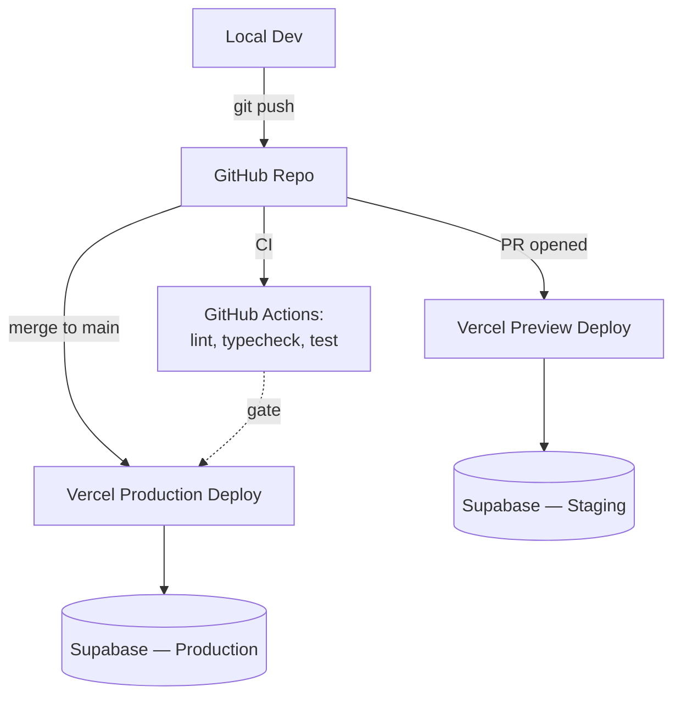
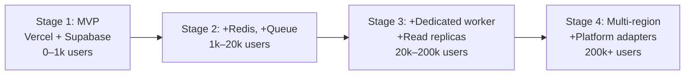

# Deployment & Scaling Specification — Personal Algorithm

*Infrastructure provisioning, deployment pathway, and growth plan for a solo, bootstrapped founder.*

---

## 1. Principles

- Target **$0–20/month** at MVP stage.
- **Zero servers to patch or babysit** — everything managed/serverless.
- Every component scales by **upgrading a tier**, not by re-architecting, up to a real usage threshold.
- Defer queues, dedicated workers, multi-region, and microservices until a specific bottleneck proves they're needed — not preemptively.

## 2. MVP Infrastructure Stack

| Component | Service | Free tier covers |
|---|---|---|
| Web app + API | Vercel (Next.js) | 100GB bandwidth/mo, generous serverless invocations |
| Database + Auth | Supabase | 500MB DB, 50k MAU auth, Row Level Security |
| Classification | Anthropic API | Pay-per-token, no minimum spend |
| Semantic retrieval | Supabase pgvector + embedding provider | Canonical concepts and aliases without a new vector service |
| Extension hosting | Chrome Web Store | One-time $5 developer registration fee |
| Error tracking | Sentry | 5k events/month free |
| Domain / DNS | Cloudflare | Free |
| Secrets | Vercel + Supabase environment variables | Built-in, no separate vault needed at this stage |

**Estimated MVP cost (first few hundred users):** $0–20/month, driven almost entirely by Anthropic API usage — everything else stays in free tiers.

## 3. Environments

| Environment | Purpose | Where |
|---|---|---|
| `local` | Day-to-day development | Supabase CLI local stack + `next dev` |
| `preview` | Per-PR review builds | Vercel preview deploys (automatic), pointed at a Supabase staging project |
| `production` | Live users | Vercel production deploy on `main`, Supabase production project |

## 4. Deployment Diagram



## 5. CI/CD Pipeline

- **On pull request:** install deps, typecheck, lint, run unit tests, build the extension bundle as a CI artifact for manual QA.
- **On merge to `main`:** Vercel's native GitHub integration auto-deploys — no custom deploy script needed.
- **Extension releases:** manual at MVP stage — `pnpm build:extension` → zip → upload via the Chrome Web Store developer dashboard. Automate later with the Chrome Web Store publish API once release frequency justifies it.

```yaml
# .github/workflows/ci.yml (abridged)
name: CI
on: [pull_request]
jobs:
  build:
    runs-on: ubuntu-latest
    steps:
      - uses: actions/checkout@v4
      - uses: pnpm/action-setup@v4
      - run: pnpm install --frozen-lockfile
      - run: pnpm typecheck
      - run: pnpm lint
      - run: pnpm test
      - run: pnpm --filter extension build
```

## 6. Step-by-Step Initial Provisioning

1. **Create a Supabase project.** Note the project URL and anon/service-role keys.
2. **Apply the schema:** `supabase db push` (runs `packages/db/schema.sql` + RLS policies).
3. **Google Cloud setup:** create a project, enable the YouTube Data API v3, create an OAuth 2.0 client (web application type for the backend flow).
4. **Set environment variables in Vercel:** `NEXT_PUBLIC_SUPABASE_URL`, `NEXT_PUBLIC_SUPABASE_ANON_KEY`, `SUPABASE_SERVICE_ROLE_KEY`, `NEXT_PUBLIC_SITE_URL`, `NEXT_PUBLIC_SUPABASE_REDIRECT_URL`, `GOOGLE_CLIENT_ID`, `GOOGLE_CLIENT_SECRET`, and `ANTHROPIC_API_KEY`.
5. **Deploy:** `vercel link` then `vercel --prod`.
6. **Extension (dev):** load unpacked via `chrome://extensions` → "Load unpacked" pointing at `apps/extension/dist`.
7. **Extension (public):** package and submit through the Chrome Web Store developer dashboard once ready for outside users.

### Deployment smoke check

After a production deploy, verify the health route and extension CORS contract:

```bash
DEPLOYMENT_URL=https://your-app.vercel.app pnpm verify:deployment
```

To also exercise authenticated live-page ranking, provide a short-lived Supabase access token without printing it:

```bash
DEPLOYMENT_URL=https://your-app.vercel.app SUPABASE_ACCESS_TOKEN="$TOKEN" pnpm verify:deployment
```

The Vercel project must deploy the `apps/web` Next.js app using `pnpm --filter web build`. The deployed app must include `apps/web/app/api/rank/route.ts` and `apps/web/middleware.ts`; a `404` for `/api/rank` means the deployment is stale or pointed at the wrong project/root.

## 7. Secrets Management

- The extension bundle is client-visible code — **never** put the Google OAuth client secret or Anthropic API key in it. The extension only ever talks to your own API; your API holds the secrets.
- Vercel encrypted environment variables cover secrets at MVP scale.
- Store YouTube refresh tokens encrypted at rest (Supabase Vault, or `pgcrypto` if Vault isn't available on your plan).

## 8. Growth Pathway

### Stage 1 — MVP (0–1k users)
Current stack as-is. No changes needed.

### Stage 2 — Early traction (1k–20k users)
- Add **Upstash Redis** in front of `feed_cache` for hot reads, reducing Postgres load.
- Move classification off the request path into a queue (Upstash QStash, or Supabase `pg_cron` + an edge function) so `/api/feed` isn't blocked waiting on the Anthropic API.
- Add a quota-tracking table for the YouTube Data API (shared 10,000 units/day free quota) and request a quota increase from Google once usage approaches it.

Discovery search is deliberately bounded at MVP scale: each sync derives at most three queries and requests at most five videos per query. YouTube `search.list` is quota-expensive, so discovery must remain a sync-time operation with cached results; page mutations and feed reads must never trigger a new search.

Semantic retrieval adds a second budget: embedding and resolver calls. Embed canonical concepts and algorithm intent, not every page mutation. Cache by content hash and algorithm revision; use deterministic aliases as the outage and cost fallback. Do not add a separate vector database before Supabase `pgvector` volume proves it necessary.

### Stage 3 — Scale (20k–200k users)
- Split classification into its own long-running worker (Fly.io or Railway) if serverless cold-starts or per-invocation cost become an issue.
- Move to a dedicated Postgres tier / add read replicas on Supabase.
- Introduce per-user classification cache windows to control Anthropic API spend as volume grows.
- Add CDN caching for static extension assets.

### Stage 4 — Platform (200k+ users)
- Multi-region deployment: Vercel edge functions + regional Supabase read replicas.
- Dedicated content-ingestion pipeline — scheduled workers continuously pulling subscription data, decoupled from the request path.
- Evaluate migrating off shared managed Postgres to a dedicated instance if connection limits become binding.
- Add further platform adapters (Reddit, X) as independent ingestion services feeding the same `content_items` schema.



## 9. Monitoring & Observability

- **Sentry** — errors from both the extension and the API.
- **Vercel** — built-in request logs and analytics, no setup required.
- **Supabase** — built-in query performance dashboard.
- **Uptime check** — a free-tier monitor (e.g. Better Uptime) hitting a simple `/api/health` route.

## 10. Backup & Disaster Recovery

- Supabase automatic daily backups on the free tier; upgrade for point-in-time recovery once real users depend on the product.
- `packages/db/schema.sql` and its migrations are tracked in git as the actual source of truth — the database can always be rebuilt from the repo.

## 11. Security Notes

- Row Level Security enforced on every table containing user data.
- OAuth tokens encrypted at rest, never exposed to the client.
- The extension never holds a secret capable of calling Google or Anthropic directly — all third-party calls are proxied through your own API.
