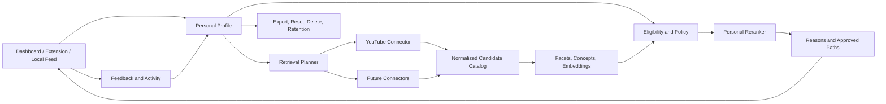

# Architecture V2 - Personal Algorithm

**Status:** Future architecture after the current MVP/recommender milestone
**Depends on:** [FUTURE_ROADMAP_V2.md](FUTURE_ROADMAP_V2.md), [Compliance_and_Viability.md](Compliance_and_Viability.md), [RECOMMENDER.md](RECOMMENDER.md)

This document describes the target architecture. It does not claim that V2 components already exist.

## 1. Architectural objective

Move from a YouTube-centered recommendation application to a connector-based personal recommendation platform:

```text
User intent and rules
        -> personal profile service
        -> connector candidate adapters
        -> normalized candidate catalog
        -> facet/concept enrichment
        -> eligibility and policy filters
        -> personal reranker
        -> presentation adapters
        -> feedback and profile revision
```

The user profile and policy layer must remain independent from any one provider, while provider-specific retrieval, quotas, OAuth scopes, retention, and deletion rules remain isolated.

## 2. Target boundaries

### 2.1 Experience surfaces

- Web dashboard: algorithm editor, calibration, profile inspection, privacy controls, billing, connector management.
- Extension: native-compatible presentation, popup controls, page ranking, replacement shelf, local cache.
- Future local feed: a first-party feed surface for users who want more control than DOM adaptation allows.

### 2.2 Personal profile service

Owns:

- explicit algorithms, goals, topics, weights, and hard rules;
- short-term session signals;
- durable affinities and confidence/evidence metadata;
- semantic concept preferences;
- profile revisions, reset, export, and deletion;
- sensitive-interest handling and retention policy.

The service must never expose raw activity events as a user profile response by default.

### 2.3 Connector adapters

Each provider adapter owns:

- authorization and token lifecycle;
- provider API calls and quota budgets;
- candidate and metadata normalization;
- provider provenance;
- provider data retention/deletion rules;
- graceful failure and circuit breaking.

Initial connector: YouTube. Future connectors must not read YouTube-specific assumptions from the core ranker.

### 2.4 Candidate and facet platform

The normalized catalog stores provider identity, title, channel/creator, published time, source, provenance, classification facets, approved concept matches, and optional model-versioned embeddings.

Rules:

- shared public content may be reused only when provenance and provider policy allow it;
- user-specific activity, affinities, and embeddings remain user-scoped;
- raw provider payloads are minimized and retained only for a documented purpose;
- rejected or pending semantic context cannot affect retrieval, ranking, or explanations.

### 2.5 Policy and eligibility layer

Runs before scoring and owns:

- hard user exclusions;
- provider/platform policy constraints;
- language and format constraints;
- watched/revisited suppression;
- source controls;
- privacy and age/safety controls;
- connector-specific eligibility.

No semantic similarity, learned affinity, or model output may bypass this layer.

### 2.6 Ranking and explanation layer

Combines explicit intent, approved semantic paths, learned affinity, quality, freshness, novelty, diversity, and controlled exploration. It returns:

- score and lane;
- concise user-facing reason;
- approved semantic path;
- safe aggregate debug provenance;
- no raw prompt, vector distance, internal UUID, or provider secret.

## 3. Target data flow



## 4. Storage model

| Domain | V2 owner | Isolation rule |
|---|---|---|
| Explicit preferences | Postgres profile tables | User-scoped RLS |
| Durable affinities | Affinity snapshot/history tables | User-scoped RLS; resettable |
| Public candidate metadata | Shared catalog | Minimized provider-derived data and provenance |
| User feedback/activity | Event tables | User-scoped RLS; retention policy |
| Semantic catalog | Governed shared catalog | Pending/rejected entries excluded from runtime |
| Embeddings | Model-versioned vector tables | Separate user/content ownership and deletion paths |
| Feed cache | Per-user/algorithm cache | User-scoped RLS; short retention |
| Connector credentials | Encrypted server-side storage | Never sent to extension/client |

## 5. Reliability and failure behavior

- A connector outage leaves cached candidates available and marks the connector stale.
- Search quota exhaustion switches to shared pool/RSS/vector retrieval.
- LLM failure switches to deterministic metadata classification.
- Embedding failure switches to lexical/concept retrieval.
- Stale ranking responses cannot overwrite a newer profile, mode, or filter generation.
- Deletion and disconnect jobs are idempotent and report incomplete provider deletion.
- Every expensive operation has a timeout, retry budget, and circuit breaker.

## 6. Security and compliance architecture

The architecture must implement the findings in [Compliance_and_Viability.md](Compliance_and_Viability.md):

- treat behavioral profiles and inferred sensitive interests as high-risk data;
- keep explicit preferences distinct from inferred affinities;
- prohibit advertising or resale use of user behavioral data;
- encrypt connector tokens at rest and rotate secrets;
- maintain RLS isolation and test it with multiple users;
- define provider-derived data retention and deletion;
- support disconnect, revocation, account deletion, and derived-data purge;
- complete a DPIA/legal review before public commercial launch;
- avoid product claims that depend on permanent YouTube API access.

## 7. V2 migration strategy

1. Stabilize the current extension and production gates.
2. Extract profile export/reset/delete behind stable APIs.
3. Introduce the connector interface around the existing YouTube sync.
4. Move provider-specific logic behind the adapter without changing feed contracts.
5. Add the first-party local feed only after extension UX and accessibility evidence is strong.
6. Add another connector only after retention, policy, and deletion behavior are documented.

No V2 migration should require a rewrite of current candidate, concept, or feed tables without a measured need.
