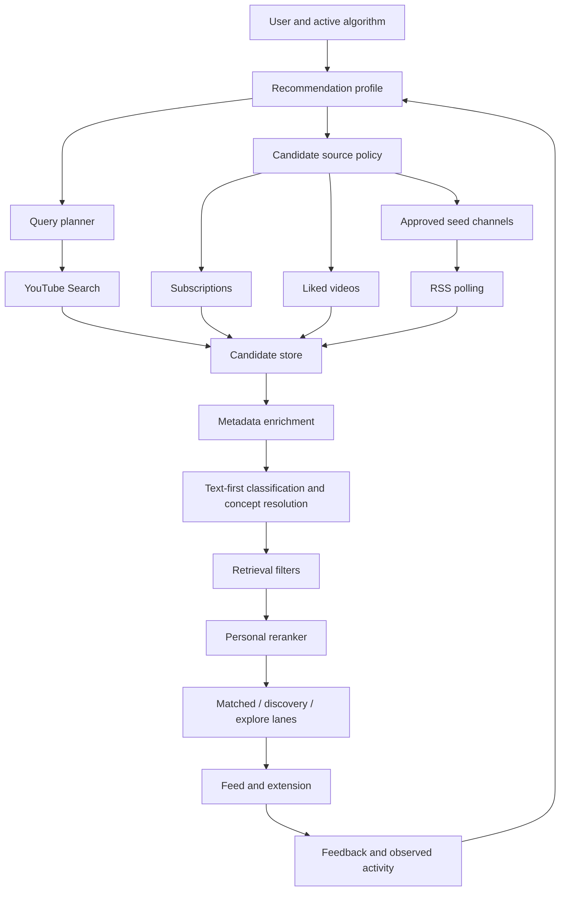

# Recommender Design

## 1. Purpose

Personal Algorithm should evolve from a feed filter into a personal recommendation layer.

The current system is primarily:

```text
Fetch a shared pool -> classify items -> rank the pool
```

The target system is:

```text
Understand the user -> generate candidates -> enrich candidates -> retrieve and filter -> rerank -> learn from feedback
```

The product promise is not simply "show gaming videos." It is:

> Understand what kind of gaming content this person actually wants, then control what enters their information environment.

This document defines the MVP architecture for that transition using the existing YouTube Data API, RSS seed-channel ingestion, Supabase, classification, and feed-ranking code.

## 2. Goals

- Preserve explicit user preferences as the authoritative direction.
- Add learned taste without silently replacing the user's intent.
- Generate content beyond the user's current subscription pool.
- Use YouTube Search for targeted retrieval and RSS for inexpensive ongoing channel ingestion.
- Keep language, format, creator, channel, topic, and source as separate dimensions.
- Keep classification text-first and metadata-driven.
- Reuse the existing feed scorer as the final reranking stage, extending it with profile dimensions.
- Keep YouTube API quota bounded and prevent page mutations from triggering searches.
- Expose useful explanations based on user preferences rather than raw classifier labels.

## 3. Non-goals for MVP

- Importing the user's complete YouTube watch history. The YouTube Data API does not provide this capability.
- Training a custom recommendation model.
- Running an image classifier on every thumbnail.
- Adding a separate vector database.
- Treating YouTube's search order as the final recommendation order.
- Per-user recurring YouTube searches on every feed read.
- Replacing explicit rules with opaque learned behavior.

Visual classification is a later option for gaps that metadata cannot solve, such as gameplay versus talking-head content or thumbnail presentation preferences.

## 4. Current implementation and boundaries

### Existing ranking path

- `apps/web/lib/feed.ts` computes topic, rule, feedback, freshness, channel, and subscription scores.
- `apps/web/app/api/feed/route.ts` reads recent `content_items`, joins classifications, ranks them, and persists `feed_cache`.
- `apps/web/app/api/rank/route.ts` ranks the videos currently visible on a YouTube page.
- Strict relevance gating, source controls, diversity limits, and explanations already exist.

### Existing YouTube Search path

- `apps/web/lib/discovery.ts` creates a bounded set of topic and goal queries.
- `apps/web/lib/youtube.ts` executes those queries with a maximum query/result budget.
- Search results are stored as `content_items` with `source_kind = 'discovery'`.
- Search is currently an algorithm-level discovery mechanism, not yet a full profile-driven candidate generator.

### Existing RSS path

- `topic_seed_channels` stores curated and discovered channels mapped to topics.
- `apps/web/lib/rss.ts` reads channel upload feeds without consuming YouTube Data API quota.
- `apps/web/lib/seed-channels.ts` groups channels, ingests recent uploads, and classifies them.
- The shared cron and algorithm activation path reuse the pool, then try RSS, then bounded cold-start discovery.
- RSS is the preferred ongoing ingestion path for approved channels, especially niche topics.

### Existing semantic intent path

- `apps/web/lib/concepts.ts` resolves canonical topics, aliases, intents, and semantic terms.
- `algorithm_intent_profiles` persists derived intent data per algorithm.
- This is the correct foundation for query expansion, but it is not itself a learned taste profile.

### Current architecture assessment

The current implementation has the ingredients of retrieval, but not yet a separate candidate-generation subsystem:

- `buildRecommendationProfile` derives explicit topics, rules, language, and formats.
- `buildDiscoveryQueries` produces a bounded query list, but the public compatibility API currently returns query strings rather than a fully annotated retrieval plan.
- YouTube Search runs during subscription sync when the shared pool is thin.
- RSS runs as shared channel ingestion and is correctly preferred for approved seed channels.
- `buildLearnedAffinityProfile` is an initial request-time signal derived from feedback-linked candidates; it is not yet a historical taste model and does not include liked videos, observed activity, creators, or entities.
- `/api/feed` still reads and reranks the recent shared pool. It is not allowed to invent candidates during a feed read, which is correct for latency and quota control.

The pasted paper therefore supports the direction, but does not justify adding a larger model or an image classifier next. The controlling product gap is still candidate coverage.

### Steering decision

The next major outcome is a standalone, quota-aware candidate-generation subsystem that assembles one normalized pool from subscriptions, approved RSS, and bounded YouTube Search. Ranking and candidate generation must have separate contracts and tests.

The MVP target should be a useful, measured pool rather than an arbitrary 200-1000 Search results. A practical budget is:

```text
shared RSS and subscription pool: primary coverage
YouTube Search: bounded gap filling only
per sync: at most 5 queries and 5 results per query
deduplicated candidate pool: normally 75-200 items across all sources
```

The system should measure topic coverage and source contribution before increasing this budget. More candidates do not help if classification, quota, latency, and deduplication costs make the feed stale.

## 5. Target architecture



The important ownership boundary is:

- Retrieval finds plausible candidates.
- The application owns eligibility and final ranking.
- RSS supplies durable channel content.
- YouTube Search supplies targeted, quota-bounded discovery.
- The extension supplies first-party behavioral signals after installation.

## 6. Recommendation profile

The profile has two layers.

### 6.1 Explicit preferences

Explicit preferences are authoritative and come from the user's algorithm:

```text
Topic weights
Goal text
Always-show and never-show rules
Language preference and hard language exclusions
Preferred formats
Source controls
Discovery and exploration settings
```

The current `algorithms`, `topic_weights`, `rules`, and `algorithm_intent_profiles` tables provide most of this foundation. Language and format preferences should be added as first-class algorithm fields or a related preference table before they are treated as ranking dimensions.

### 6.2 Learned taste

Learned taste fills in nuance around the explicit direction:

```text
topic_affinity
channel_affinity
creator_affinity
format_affinity
language_affinity
source_affinity
negative_affinity
novelty_preference
```

Each affinity should have:

```text
key
signed value in [-1, 1]
confidence
sample count
last observed timestamp
source signal
```

Initial signals, from strongest to weakest:

1. Explicit `never_show` and `always_show` rules.
2. Positive and negative feedback events.
3. Liked videos, when the YouTube connection permits importing them.
4. Subscriptions as weak positive channel signals.
5. Extension-observed opens, approximate watch duration, revisits, and skips.
6. Search and discovery interactions.

The profile should be derived server-side first. A materialized profile table can be added once recomputation becomes expensive or the signal history needs auditing.

## 7. Content taxonomy

Classification must not place every extracted label into one undifferentiated `topics` array.

Every candidate should eventually expose separate facets:

```text
channel_id
channel_name
publisher
creator
canonical_topics
entities
language
region
format
content_type
category
duration
published_at
source_kind
```

For example:

```text
channel: IGN China
publisher: IGN
language: zh-Hans
region: CN
format: review
topics: gaming, RPG
```

`IGN` is a publisher or channel-related feature, not automatically a user topic. Topic matching should use canonical concepts, aliases, and bounded semantic terms. Case normalization must be applied before comparing feature keys.

Hard constraints should be applied before soft scoring:

```text
Explicit English-only preference + Chinese candidate -> reject
never_show rule -> reject
subscribed-only + discovery candidate -> reject
hide Shorts + short candidate -> reject
```

## 8. Candidate sources

Candidate generation combines several lanes. Each lane emits the same normalized `FeedCandidate` shape and records its provenance.

### 8.1 Subscription uploads

Use the existing authenticated YouTube subscription and upload path. Subscriptions are a useful baseline and a weak positive channel-affinity signal, but they are not enough to satisfy niche interests.

### 8.2 Liked videos

When the OAuth scope and provider flow support it, import liked-video metadata through the YouTube API. Use these items to learn topics, creators, formats, and language. Do not treat likes as an automatic permanent allow-list; they are profile evidence.

### 8.3 YouTube Search

Use `search.list` for targeted retrieval:

- topic and subtopic searches
- goal and intent searches
- creator/channel searches
- format-specific searches
- freshness searches

Pass language and region constraints into retrieval when explicitly configured. Search results are candidates, not final recommendations. Store the query and retrieval lane for explanation and evaluation.

Search must remain bounded:

```text
Maximum queries per sync: configured small limit
Maximum results per query: configured small limit
Deduplicate by source and external_id
Cache results by query, algorithm revision, and time window
Never search from a page mutation or ordinary feed read
```

### 8.4 Approved RSS seed channels

RSS is the primary ongoing source for approved channels:

- It consumes no YouTube Data API search quota.
- It is shared across users and topics.
- It works well for niche topics and recurring channel uploads.
- It should continue to populate the shared `content_items` pool through cron.

RSS should not be treated as personalized retrieval by itself. The profile determines which topics, channels, and sources are eligible during reranking.

Pending channels discovered by search must remain pending until the review workflow or confidence policy approves them.

### 8.5 Extension-observed candidates

After installation, the extension can provide first-party signals:

```text
video opened
video revisited
approximate watch duration
more-like-this
not-interested
never-show-channel
```

The extension should not become the only candidate source. It enriches the profile and can optionally submit page candidates for reranking.

## 9. Query planner

The planner expands a profile into several independent queries instead of concatenating every preference into one broad query.

Example profile:

```text
Gaming 40
RPG 25
Nintendo 15
Game development 10
Strategy 10
Language: English
Formats: review, developer commentary, deep analysis
```

Possible queries:

```text
Nintendo RPG deep dive
Nintendo RPG review
Nintendo game developer commentary
JRPG development interview
Nintendo strategy games analysis
Nintendo RPG technical analysis
```

The planner should:

1. Select strong explicit topics first.
2. Add canonical aliases and intent terms from the algorithm intent profile.
3. Combine one or two related concepts per query.
4. Add preferred formats as retrieval terms.
5. Add the goal text as a separate query when useful.
6. Add creator queries for strong learned creator affinity.
7. Add a small freshness lane.
8. Remove duplicate and low-information queries.
9. Apply the configured query and result budget.

A planned query should carry metadata:

```ts
{
  text: string;
  lane: 'topic' | 'intent' | 'creator' | 'format' | 'freshness';
  topics: string[];
  language?: string;
  region?: string;
  algorithmRevision: string;
}
```

## 10. Retrieval and enrichment pipeline

```text
1. Load active algorithm and explicit preferences.
2. Load or derive the recommendation profile.
3. Reuse eligible classified content from the shared pool.
4. Poll approved RSS seed channels when the pool is thin or stale.
5. Build bounded YouTube Search queries for missing topic coverage.
6. Execute searches only during sync/activation jobs.
7. Upsert candidates with source and query provenance.
8. Enrich missing metadata in bounded batches.
9. Classify title, description, channel, tags, category, language, and format.
10. Apply hard eligibility constraints.
11. Rerank surviving candidates against the profile.
12. Allocate results across matched, discovery, and explore lanes.
13. Persist feed cache and explanation data.
14. Record feedback and observed activity for the next profile revision.
```

The existing activation tiers remain useful:

```text
Tier 0: reuse sufficient shared classified pool
Tier 1: poll approved RSS seed channels
Tier 2: run bounded cold-start search, review or approve channels, then poll RSS
```

The recommender should add profile-aware retrieval without discarding this cost-aware order.

## 11. Reranking model

The final score should combine dimensions rather than treating all labels as topics:

```text
score =
    explicit_topic_match
  + semantic_intent_match
  + learned_topic_affinity
  + creator_affinity
  + channel_affinity
  + format_affinity
  + language_affinity
  + source_affinity
  + freshness
  + controlled_exploration
  + rule_boosts
  + positive_feedback
  - negative_affinity
  - repetition_penalty
  - quality_penalty
```

Hard exclusions are applied before this score. Existing channel diversity, series suppression, source controls, feedback suppression, and strict topic eligibility remain in force.

Scores and explanations should identify meaningful reasons:

```text
Strong match for RPG
Matches your Nintendo preference
English content
Developer commentary format
From a channel similar to ones you follow
Slightly older content
```

Avoid explanations such as `matched ign + IGN + Gaming`.

## 12. Feed lanes

The feed should distinguish three conceptual lanes:

### Matched

Strongly aligned with explicit and learned preferences. This is the majority of the feed.

### Discovery

Adjacent to known interests, often from a new channel, alias, intent, or related format. Discovery must still pass minimum relevance and hard constraints.

### Explore

A small controlled allocation outside the strongest known preferences. Explore is optional, bounded, and never allowed to override explicit exclusions.

The initial lane mix should be configurable and observable rather than permanently hard-coded. Empty matched results should not be filled with unrelated content simply to avoid an empty screen.

## 13. Persistence and API direction

The existing tables remain the source of truth for the first implementation:

- `algorithms`, `topic_weights`, and `rules`: explicit preferences.
- `algorithm_intent_profiles`: canonical concepts and query expansion.
- `content_items`: shared normalized candidates.
- `classifications`: cached metadata classification.
- `topic_seed_channels`: approved RSS and discovered channel catalog.
- `feedback_events`: explicit user feedback.
- `feed_cache`: personalized ranked output.

Recommended additions:

```text
content_items.raw_metadata
  Store bounded provider metadata needed for enrichment and debugging.

content facets
  Store language, format, duration, category, and region separately from topics.

retrieval provenance
  Store source lane, query text or query hash, and retrieval timestamp.

profile revisions
  Store a revision or generated_at value so query and ranking behavior is reproducible.
```

Do not add a permanent taste-profile table until the derived profile is correct and recomputation cost is demonstrated. When added, it should be user-scoped with RLS and retain enough provenance to explain how an affinity was learned.

Potential API boundaries:

```text
POST /api/algorithms/activate
  Build or refresh candidates for an algorithm using the tiered strategy.

GET /api/feed
  Read cached candidates and rerank or refresh within strict cost limits.

POST /api/feedback
  Record explicit feedback and schedule profile recomputation.

POST /api/activity
  Record extension-observed first-party behavior with privacy limits.

GET /api/recommendation-profile
  Return user-facing profile facets and confidence, not raw implementation details.
```

A separate `/api/discover` endpoint is optional. The first implementation can extend activation and feed generation while keeping retrieval jobs separate from page ranking.

## 14. Rollout plan

### Phase 1: Normalize the recommender contract

- Add typed profile, candidate, query, facet, and provenance contracts.
- Normalize topic keys and keep channel/publisher/language/format separate.
- Build a pure profile derivation function from explicit preferences, intent profiles, feedback, and available content metadata.
- Add deterministic tests before changing live retrieval.

### Phase 2: Profile-driven query planning

- Replace direct algorithm-only query construction with the profile query planner.
- Keep current YouTube Search limits and caching.
- Add language and format retrieval parameters where configured.
- Test multi-topic coverage and query deduplication.

### Phase 3: Unified RSS and Search candidate ingestion

- Reuse the existing RSS shared pool.
- Add query/source provenance to Search candidates.
- Enrich missing metadata before classification.
- Ensure approved seed channels and Search candidates share the same candidate contract.

### Phase 4: Profile-aware reranking

- Add language, format, creator, and learned affinity scoring.
- Preserve strict exclusions and relevance gating.
- Add matched/discovery/explore lane allocation.
- Replace raw implementation explanations with preference-based reasons.

### Phase 5: Learning loop

- Import liked videos where OAuth permits.
- Record extension activity with clear retention limits.
- Recompute affinities from feedback and activity.
- Add a user-facing "teach my algorithm" calibration flow after the core loop is reliable.

### Phase 6: Later intelligence

- Add semantic similarity only where deterministic metadata is insufficient.
- Consider visual classification for demonstrated gaps such as gameplay versus talking-head content.
- Add a materialized taste profile or vector retrieval only after scale or quality evidence justifies it.

## 15. Acceptance criteria for the first recommender milestone

- A selected algorithm produces more than subscription-only content when approved RSS or Search candidates exist.
- The query planner generates multiple bounded queries across strong topics and intents.
- RSS and YouTube Search candidates enter the same normalized candidate pipeline.
- `IGN` or another channel/publisher name cannot become a topic solely because it appears in metadata.
- Explicit language and format constraints are applied during retrieval or as hard eligibility rules.
- Search runs only in activation/sync work, never on page mutation or ordinary feed reads.
- Candidate provenance is available for debugging and explanations.
- Existing strict relevance, source controls, diversity, feedback suppression, and empty-state behavior remain green.
- Tests cover candidate-source merging, query planning, taxonomy normalization, hard exclusions, and ranking explanations.

## 16. Immediate next engineering task

Implement a standalone candidate-generation coordinator that consumes the recommendation profile and returns a deduplicated, provenance-preserving candidate pool from the shared content pool, approved RSS, subscriptions, and bounded YouTube Search.

The coordinator should run only from activation or sync jobs. `/api/feed` and page ranking should consume its cached output and never trigger retrieval. This is the smallest change that moves the product from "rank the current pool" toward "generate a pool for this user" without prematurely introducing new infrastructure or an opaque model.

## 17. Implementation checklist

### Milestone 1: Profile and query planner

- [ ] Define the typed `RecommendationProfile`, query, facet, and provenance contracts.
- [x] Derive explicit topics, semantic terms, positive rules, negative rules, and format intent from an algorithm.
- [x] Generate bounded, deduplicated, annotated queries across goal, topic, alias, intent, creator, format, and freshness lanes.
- [x] Keep query generation deterministic and independent of network or database access.
- [x] Preserve the existing `buildDiscoveryQueries` API while routing it through the planner.
- [x] Add tests for multi-topic coverage, aliases, negative rules, deduplication, and query limits.

### Milestone 2: Unified candidate retrieval

- [x] Add a shared candidate contract for subscription, YouTube Search, and RSS items.
- [x] Record retrieval lane and query provenance for Search candidates.
- [x] Reuse the shared RSS pool before spending YouTube Search quota.
- [x] Run Search only from activation or sync jobs, never from page mutations or ordinary feed reads.
- [x] Add language and format constraints to retrieval when explicit preferences exist.
- [x] Add a candidate-generation coordinator with source budgets, coverage accounting, and deterministic deduplication.
- [x] Return retrieval provenance and source contribution metrics from the coordinator.
- [x] Add reusable candidate-pool assembly with deterministic deduplication for subscription and Search batches.
- [x] Return source contribution and topic-coverage metrics from YouTube sync.

### Milestone 3: Profile-aware reranking

- [x] Separate topic, channel, publisher, language, format, creator, and source facets in classification.
- [x] Add hard eligibility checks for explicit language, format, source, and exclusion rules.
- [x] Add learned topic, channel, creator, format, language, and source affinities.
- [x] Allocate visible results into matched, discovery, and explore lanes; keep exploration opt-in through explicit overrides until a configurable mix is added.
- [ ] Replace raw classifier labels in explanations with preference-based reasons.

### Milestone 4: Learning loop and calibration

- [ ] Import liked-video metadata when the OAuth scope permits it.
- [ ] Record privacy-bounded extension activity such as opens, revisits, and approximate watch duration.
- [ ] Recompute profile affinities from feedback and observed activity.
- [ ] Add a user-facing taste calibration flow.
- [ ] Evaluate semantic or visual classification only where text-first metadata leaves a demonstrated gap.

## 18. Architecture decision record: retrieval before sophistication

### Decision

Prioritize candidate coverage and source orchestration before adding embeddings, image understanding, or a more complex learned ranker.

### Why

The current ranker can only select from `content_items` that already exist. A perfect score cannot recommend a video that was never retrieved. RSS gives inexpensive recurring coverage, while YouTube Search is useful for bounded topic-gap filling and channel discovery.

### Consequences

- Candidate generation becomes a server-side job boundary with explicit budgets.
- Search results must be cached and attributed to a query/lane.
- Feed reads remain fast and deterministic.
- Ranking quality can be evaluated separately from retrieval coverage.
- The learned profile remains deliberately modest until more behavioral data exists.

### Rejected next steps

- Do not add an image classifier now; the current metadata facets are not yet fully measured.
- Do not create a permanent taste-profile table now; request-time feedback-derived affinities are sufficient for the next retrieval slice.
- Do not expand Search to hundreds of results per user; use RSS and shared pool coverage first.
- Do not let YouTube's result order become the application ranking order.
